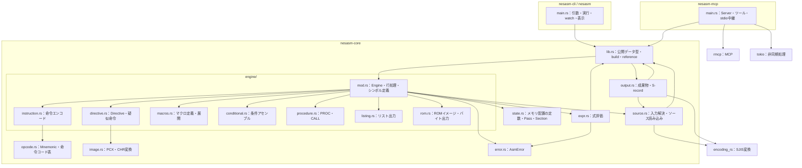
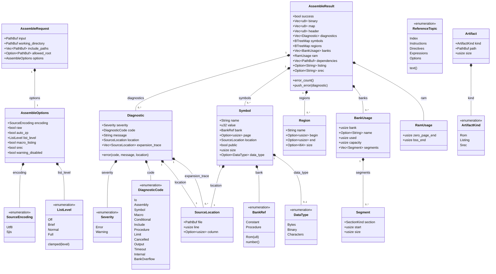
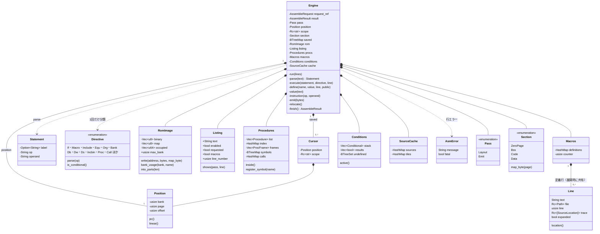
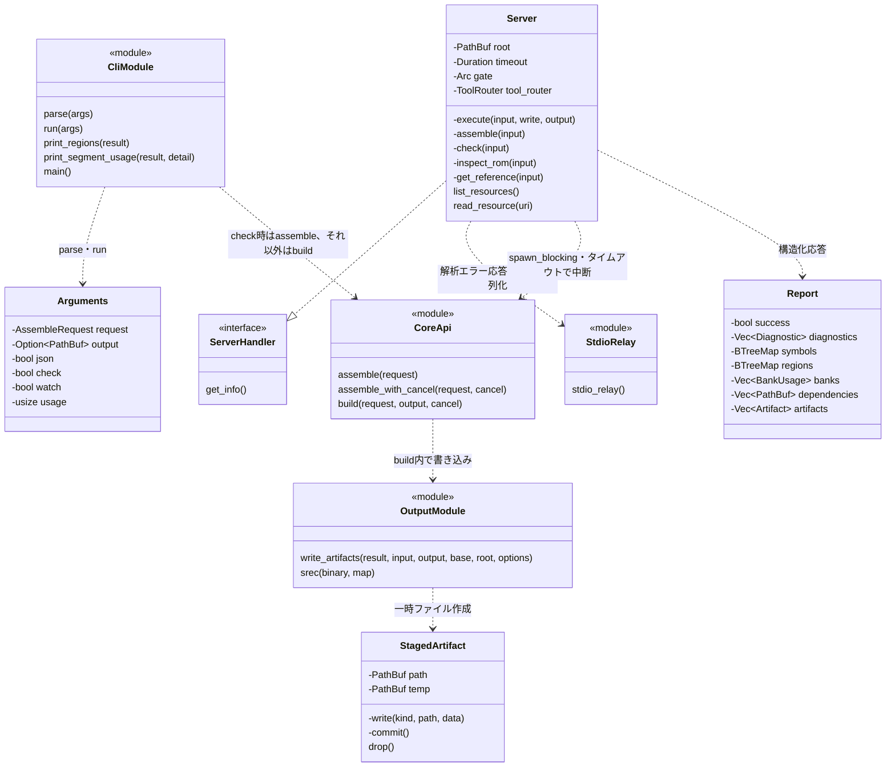
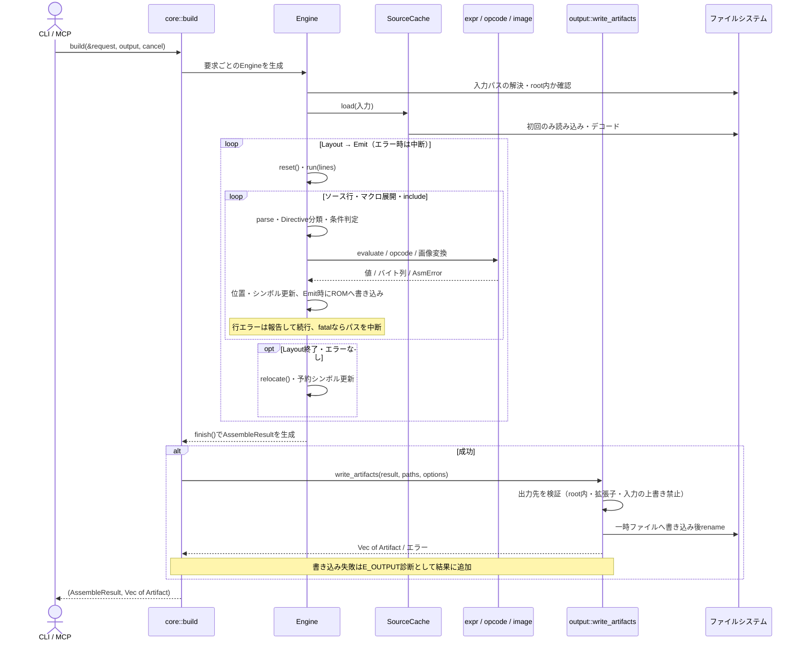

# Rust版のUML図

`crates/nesasm-core`、`crates/nesasm-cli`、`crates/nesasm-mcp` の実装をもとにした図です。
C#版とテスト用の型は対象に含めません。Mermaid対応のMarkdownビューアやGitHubで表示できます。

Rustのstructをクラス、enumを列挙型、traitをインターフェースとして表します。
`*--` は値としての所有、`-->` は借用・参照、`..>` は呼び出し・生成などの依存、
`..|>` はtraitの実装です。`+` は公開、`-` は非公開を表します。
`pub(crate)` と `pub(super)` の型は内部型として扱います。
フィールド・操作は主要なものを抜粋し、ライフタイムとderiveによるtrait実装は省略しています。
モジュールの図示に使う `<<module>>` は説明用の表現で、実在するstructではありません。

## 1. クレートとモジュールの依存関係

UMLのパッケージ間依存をMermaidのフローチャートで表現しています。
矢印は利用側から利用先へ向きます。外部ライブラリは主なものだけを示します。

`lib.rs` は `assemble`、`assemble_with_cancel`、`build`、`write_artifacts`、`reference`
と公開データ型を提供します。CLIとMCPはこの公開APIだけを利用します。
`assemble` は入力を読み込み、結果をメモリ上に作ります。`build` はアセンブルに続けて
成果物を書き込み、書き込みの失敗を `E_OUTPUT` 診断として結果に加えます。
JSONスキーマの導出（`schemars`）は `schema` featureで有効になり、MCPだけが使います。

## 2. 公開APIのクラス図

出典：[lib.rs](../crates/nesasm-core/src/lib.rs)、[output.rs](../crates/nesasm-core/src/output.rs)。

`symbols` は `BTreeMap<String, Symbol>`、`regions` は `BTreeMap<String, Region>` です。
`Artifact` は `AssembleResult` のフィールドではなく、`build`・`write_artifacts` が返す成果物情報です。
`binary` はiNESヘッダを含まないROMペイロードで、`header` と分けて保持します。
JSONでは互換性のため、`DiagnosticCode` を `"E_IO"` などの文字列、`BankRef` を数値
（ROMバンク、定数は240、未配置のプロシージャは241）、`ListLevel` を0〜3の数値で表します。

## 3. アセンブラ内部のクラス図

出典：[engine/](../crates/nesasm-core/src/engine/)、[state.rs](../crates/nesasm-core/src/state.rs)、
[source.rs](../crates/nesasm-core/src/source.rs)、[error.rs](../crates/nesasm-core/src/error.rs)。

図中の `request_ref` は、実際のフィールド `request: &AssembleRequest` を表します。
`Position` は物理位置だけを持つ `Copy` 型で、ローカルラベルの所属先（`scope`）は別に保持します。
セクション・バンクの切り替えでは、位置と `scope` を `Cursor` として保存・復元します。
各行は `Directive::parse` で1回だけ分類し、別名（`DB`/`BYTE`、`MACRO`/`MAC` など）は同じ値になります。
`SourceCache` は読み込んだソースとPCXの変換結果を2つのパスで共有し、同じファイルを再読込しません。
`Line` はファイルパスを `Rc<Path>`、展開・includeの経路を `Rc<[SourceLocation]>` で共有します。
`AsmError` の `fatal` はバンクあふれや上限超過など、そのパスを中断するエラーを表します。

## 4. 式評価と命令・画像変換

出典：[expr.rs](../crates/nesasm-core/src/expr.rs)、[opcode.rs](../crates/nesasm-core/src/opcode.rs)、
[instruction.rs](../crates/nesasm-core/src/engine/instruction.rs)、[image.rs](../crates/nesasm-core/src/image.rs)。

```mermaid
classDiagram
    class Engine
    class ExprModule {
        <<module>>
        evaluate(text, ctx)
    }
    class Context {
        BTreeMap symbols_ref
        BTreeMap regions_ref
        BTreeMap functions_ref
        str global_ref
        u32 pc
        bool allow_undefined
        Cell function_calls_ref
    }
    class Parser {
        -Vec~Token~ tokens
        -usize pos
        -Context ctx_ref
        -usize depth
        -expr(min)
        -binary(op, left, right)
        -function(name, parens)
    }
    class Token {
        <<enumeration>>
        Number(u32)
        Name(str)
        String(str)
        Op(Op)
        End
    }
    class Op {
        <<enumeration>>
        Add・Sub・Mul・Div・Mod・Shl・Shr
        Or・Xor・And・Complement・Not
        Eq・Ne・Lt・Le・Gt・Ge
        Open・Close・Comma
        precedence()
    }
    class Mnemonic {
        <<enumeration>>
        Adc・And・Asl・… ・Tya
        parse(name)
        opcode(mode)
    }
    class Mode {
        <<enumeration>>
        Acc・Imm・Zp・Zpx・Zpy
        Zi・Zix・Ziy・Abs・Ax・Ay
        Ind・Ix・Imp・Rel
    }
    class Operand {
        -str expr
        -Mode mode
        -Option~u8~ auto_increment
        -Option~u8~ auto_tag
    }
    class ImageModule {
        <<module>>
        packed_tile(rows, validate)
        pcx_tiles(data, args)
    }
    Engine ..> Context : 式評価時に生成
    Engine ..> ExprModule : 式評価
    ExprModule ..> Parser : 字句解析後に生成
    Parser "1" *-- "1..*" Token : tokens
    Token ..> Op
    Engine ..> Operand : オペランド解析
    Engine ..> Mnemonic : 命令コード取得
    Mnemonic ..> Mode
    Engine ..> ImageModule : DEFCHR・INCCHR
```

`Token` の名前と文字列は式テキストのスライスを借用し、トークンごとに `String` を作りません。
`Context` の `_ref` は参照フィールドで、シンボル表・領域表・関数表を所有しません。
`allow_undefined` は通常の式評価ではLayoutパス中に有効になり、未定義シンボルを0として扱います。
`strict_value` はパスに関係なく未定義シンボルを許可しません。
`function_calls` は1回のアセンブル全体での式関数の呼び出し回数で、上限を超えると致命的エラーです。

## 5. CLI・MCPと成果物出力

出典：[CLI main.rs](../crates/nesasm-cli/src/main.rs)、[MCP main.rs](../crates/nesasm-mcp/src/main.rs)、
[output.rs](../crates/nesasm-core/src/output.rs)。

`ServerHandler` はrmcpのtraitです。MCPツールはRust上では非公開メソッドですが、
マクロによってMCPの `assemble`・`check`・`get_reference` として公開されます。
`gate` の型は `Arc<tokio::sync::Mutex<()>>` で、checkとassembleの実行を直列化します。
時間制限を超えると `assemble_with_cancel` に渡したフラグを立て、エンジンは次の行で停止します。
`stdio_relay` はstdinとrmcpの間で行を中継し、JSONとして解析できない行に `-32700` を返します。
MCPでは `allowed_root` を指定するため、出力先は `.nes`／`.bin` と派生ファイルに限られます。

## 6. アセンブルと成果物生成のシーケンス図

CLIとMCPに共通する流れです。MCP固有のMutex・非同期タスク・応答変換は省略しています。

Layoutパスは配置とシンボルを計算し、その後 `relocate` がプロシージャの配置を確定します。
EmitパスはそのROMとmapを生成します。Layoutパスでは `INCBIN` のファイル本体を読まず、
サイズだけで位置を進めます。失敗結果では `binary` と `map` を空にします。
一時ファイルは `Drop` で後片付けします。複数成果物のrenameは順に実行されるため、
途中の失敗で既に確定した成果物を元に戻すトランザクションにはなっていません。
