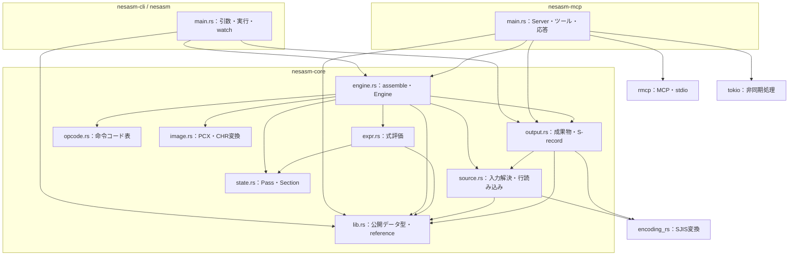
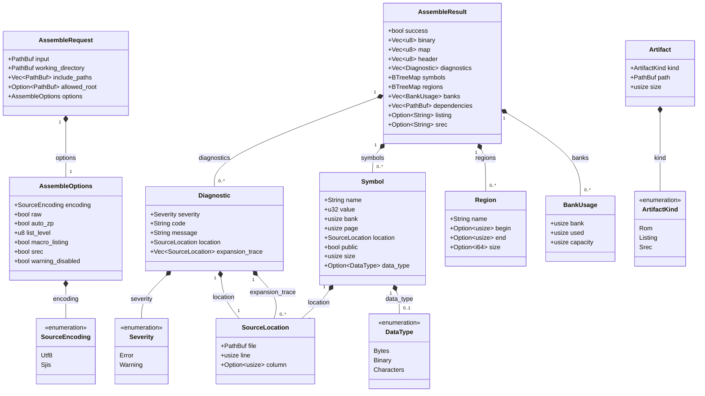
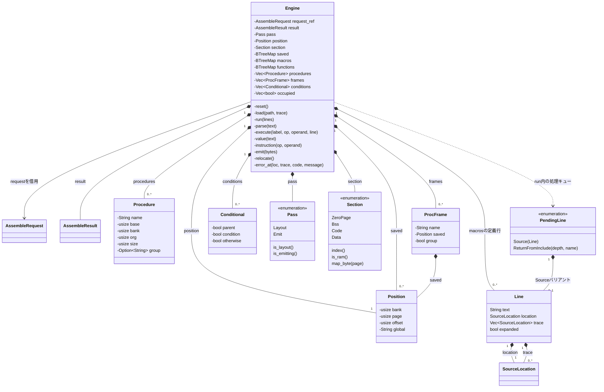
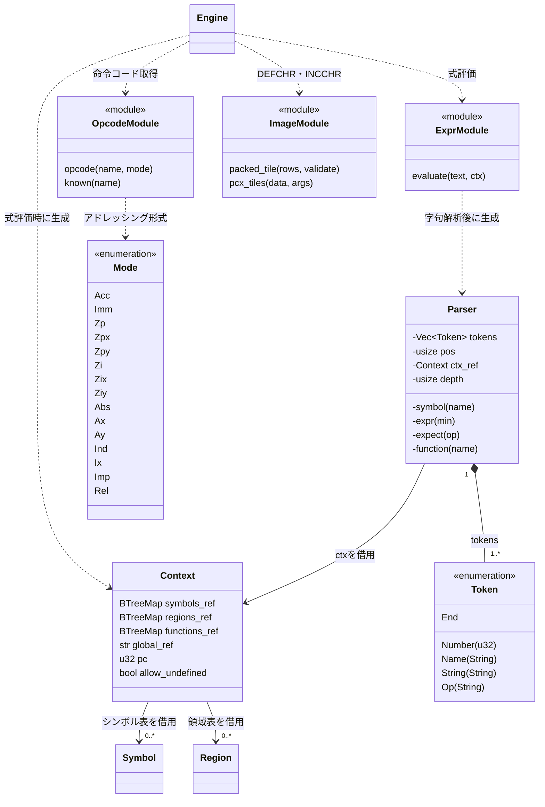
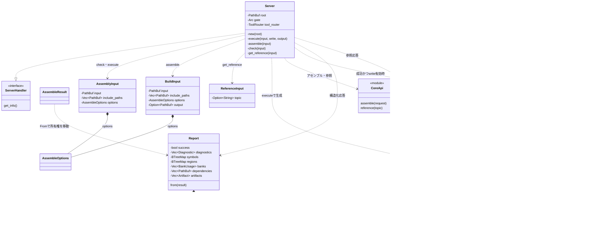
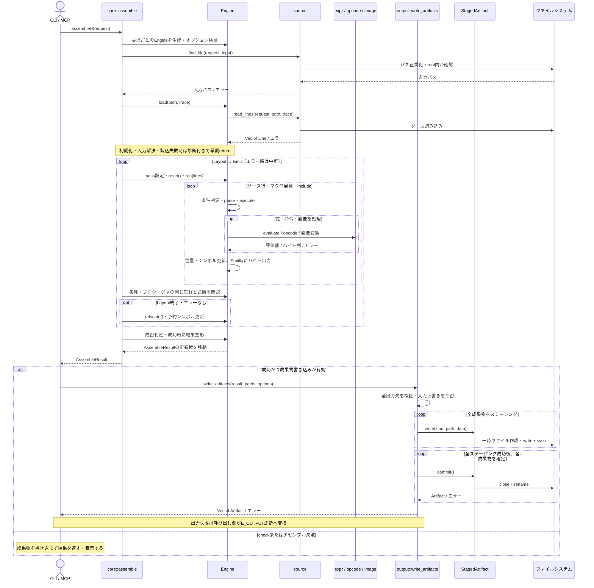

# Rust版のUML図

`crates/nesasm-core`、`crates/nesasm-cli`、`crates/nesasm-mcp` の実装をもとにした図です。
C#版とテスト用の型は対象に含めません。Mermaid対応のMarkdownビューアやGitHubで表示できます。

Rustのstructをクラス、enumを列挙型、traitをインターフェースとして表します。
`*--` は値としての所有、`-->` は借用・参照、`..>` は呼び出し・生成などの依存、
`..|>` はtraitの実装です。`+` は公開、`-` は非公開を表します。
`pub(crate)` と `pub(super)` の型は内部型として扱います。
フィールド・操作は主要なものを抜粋し、ライフタイムとderiveによるtrait実装は省略しています。
モジュールの図示に使う `<<module>>` は説明用の表現で、実在するstructではありません。

## 1. クレートとモジュールの依存関係

UMLのパッケージ間依存をMermaidのフローチャートで表現しています。
矢印は利用側から利用先へ向きます。外部ライブラリは主なものだけを示します。

`lib.rs` は `assemble`、`write_artifacts`、`Artifact`、`ArtifactKind`、
`resolve_path` を再公開します。CLIとMCPはこの公開APIを利用します。
コアの `assemble` は入力を読み込み、結果をメモリ上に作ります。
成果物ファイルの書き込みは呼び出し側が `write_artifacts` で行います。

## 2. 公開APIのクラス図

出典：[lib.rs](../crates/nesasm-core/src/lib.rs)、[output.rs](../crates/nesasm-core/src/output.rs)。

`symbols` は `BTreeMap<String, Symbol>`、`regions` は `BTreeMap<String, Region>` です。
`Artifact` は `AssembleResult` のフィールドではなく、`write_artifacts` が返す成果物情報です。
`binary` はiNESヘッダを含まないROMペイロードで、`header` と分けて保持します。

## 3. アセンブラ内部のクラス図

出典：[engine.rs](../crates/nesasm-core/src/engine.rs)、[state.rs](../crates/nesasm-core/src/state.rs)、
[source.rs](../crates/nesasm-core/src/source.rs)。

図中の `request_ref` は、実際のフィールド `request: &AssembleRequest` を表します。
`saved` は `(Section, usize)` をキーにした位置の保存、`macros` は名前から `Vec<Line>` への対応です。
`PendingLine` のキューは `run` のローカル変数で、Engineのフィールドではありません。
`ReturnFromInclude` はincludeから戻る際の深さと名前を保持します。

## 4. 式評価と命令・画像変換

出典：[expr.rs](../crates/nesasm-core/src/expr.rs)、[opcode.rs](../crates/nesasm-core/src/opcode.rs)、
[image.rs](../crates/nesasm-core/src/image.rs)。

`Context` の `_ref` は実際には参照フィールドです。シンボル表・領域表・関数表を所有しません。
`allow_undefined` は通常の式評価ではLayoutパス中に有効になり、未定義シンボルを0として扱います。
`strict_value` はパスに関係なく未定義シンボルを許可しません。

## 5. CLI・MCPと成果物出力

出典：[CLI main.rs](../crates/nesasm-cli/src/main.rs)、[MCP main.rs](../crates/nesasm-mcp/src/main.rs)、
[output.rs](../crates/nesasm-core/src/output.rs)。

`ServerHandler` はrmcpのtraitです。MCPツールはRust上では非公開メソッドですが、
マクロによってMCPの `assemble`・`check`・`get_reference` として公開されます。
`gate` の型は `Arc<tokio::sync::Mutex<()>>` で、checkとassembleの実行を直列化します。
`tool_router` の型は `ToolRouter<Self>` です。アセンブル処理は `spawn_blocking` で実行します。
`Report::from` は診断・シンボル・領域・使用量・依存パスを移動し、ROMバイト列を応答に含めません。
成果物情報は書き込み後に `Report.artifacts` に設定されます。

## 6. アセンブルと成果物生成のシーケンス図

CLIとMCPに共通する流れです。MCP固有のMutex・非同期タスク・応答変換は省略しています。

Layoutパスは配置とシンボルを計算し、その後 `relocate` がプロシージャの配置を確定します。
Emitパスはその配置に基づいてROMとmapを生成します。
失敗結果では `binary` と `map` を空にします。
一時ファイルは `Drop` で後片付けします。複数成果物のrenameは順に実行されるため、
途中の失敗で既に確定した成果物を元に戻すトランザクションにはなっていません。
